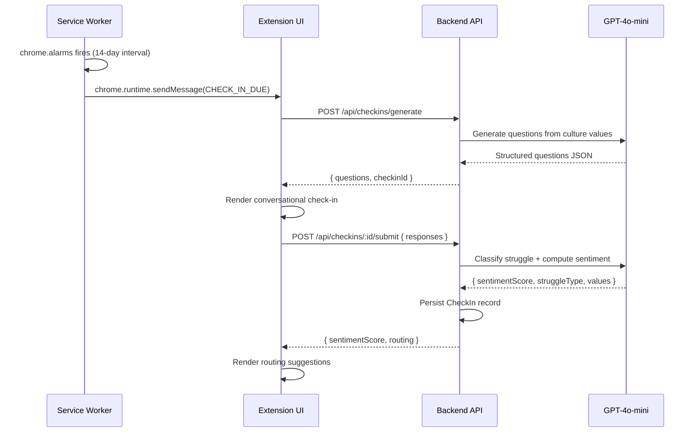

# Design Document: Afloat Onboarding Assistant Chrome Extension

## Overview

Afloat is a Chrome Extension (Manifest V3) that acts as an AI-powered onboarding co-pilot for new employees. The **Mission_Control** persona — calm, intelligent, always-on — lives in the browser as a popup or pinned side panel. It conducts biweekly check-ins anchored to company culture values, classifies employee struggles as `HUMAN` or `TECHNICAL`, and routes them to the right resource (Culture Champion, Knowledge Base article, or GitHub contributor) without requiring them to leave their workflow.

This design is scoped for a **7-hour hackathon prototype**. Every decision prioritizes speed of implementation over production-grade robustness.

### Key Design Principles

- **Browser-first**: All UI lives in the Chrome Extension; no separate web app needed for the prototype.
- **LLM-heavy**: Lean on the LLM for classification, question generation, and Q&A rather than building custom ML pipelines.
- **Minimal backend**: A thin Express/Node.js API handles auth, data persistence, and LLM proxying. The extension talks to this single backend.
- **Mock-friendly**: GitHub Blame and Knowledge Base can be seeded with mock data for the demo without blocking core feature development.

---

## Tech Stack

| Layer | Choice | Rationale |
|---|---|---|
| Extension UI | **React 18 + Vite** (via CRXJS plugin) | Fast dev loop, hot reload in extension context, familiar ecosystem |
| Styling | **Tailwind CSS** | Utility-first, no design system setup needed, compact output |
| State management | **Zustand** | Minimal boilerplate, works well with Chrome storage sync |
| Backend | **Node.js + Express** | Fast to scaffold, huge ecosystem, team familiarity |
| Database | **SQLite via better-sqlite3** | Zero-config, file-based, no Docker needed for hackathon |
| Auth | **JWT (jsonwebtoken) + bcrypt** | Simple, stateless, no OAuth setup overhead |
| AI/LLM | **OpenAI GPT-4o-mini** via `openai` SDK | Best cost/quality ratio, structured outputs via JSON mode |
| Vector search (KB) | **LangChain.js + in-memory vector store** | Fast to seed, no external vector DB needed |
| Charts | **Recharts** | React-native, minimal config for sentiment trend line |
| HTTP client | **axios** | Familiar, interceptor support for auth headers |

---

## Architecture

### High-Level Component Diagram

```mermaid
graph TB
    subgraph Chrome Extension
        POPUP[Popup / Side Panel UI<br/>React + Zustand]
        SW[Background Service Worker<br/>Alarm scheduling, badge management]
        CS[Content Script<br/>Optional: page context]
    end

    subgraph Backend API (Express)
        AUTH[Auth Router<br/>/api/auth]
        CHECKIN[Check-In Router<br/>/api/checkins]
        KB[Knowledge Base Router<br/>/api/kb]
        GH[GitHub Router<br/>/api/github]
        MANAGER[Manager Router<br/>/api/manager]
        LLM[LLM Service<br/>OpenAI GPT-4o-mini]
        VS[Vector Store<br/>LangChain in-memory]
        DB[(SQLite Database)]
    end

    POPUP -->|REST + JWT| AUTH
    POPUP -->|REST + JWT| CHECKIN
    POPUP -->|REST + JWT| KB
    POPUP -->|REST + JWT| GH
    POPUP -->|REST + JWT| MANAGER
    SW -->|chrome.alarms| POPUP
    CHECKIN --> LLM
    KB --> LLM
    KB --> VS
    GH -->|GitHub REST API| GITHUB_API[GitHub API]
    AUTH --> DB
    CHECKIN --> DB
    MANAGER --> DB
```

### Data Flow: Check-In Lifecycle



### Chrome Extension Structure

```
afloat-extension/
├── manifest.json          # MV3 manifest
├── src/
│   ├── popup/             # Popup entry point (index.html + main.tsx)
│   ├── sidepanel/         # Side panel entry point (sidepanel.html + main.tsx)
│   ├── background/        # Service worker (background.ts)
│   ├── components/        # Shared React components
│   │   ├── CheckIn/
│   │   ├── Dashboard/
│   │   ├── Chat/
│   │   └── Manager/
│   ├── store/             # Zustand stores
│   ├── api/               # axios API client
│   └── types/             # Shared TypeScript types
├── public/
│   └── icons/
└── vite.config.ts
```

---

## Components and Interfaces

### Extension UI Components

#### `<App />` (Root)
- Reads auth token from Chrome local storage on mount
- Routes to `<LoginScreen />` or `<MainShell />` based on auth state
- Subscribes to `chrome.runtime.onMessage` for badge/notification events

#### `<MainShell />`
- Tab bar: **Chat** | **Dashboard** | **Manager** (Manager tab hidden for `New_Employee` role)
- Renders `<Popup />` or `<SidePanel />` layout wrapper based on `displayMode` in Zustand store
- "Pin to Side Panel" button calls `chrome.sidePanel.open()`

#### `<CheckInFlow />`
- Stepper component: renders one question at a time
- Collects free-text responses
- On final submission: calls `POST /api/checkins/:id/submit`
- Renders `<RoutingCard />` with suggestions after submission

#### `<Chat />`
- Persistent conversation thread (stored in Zustand + Chrome local storage)
- Input box sends to `POST /api/kb/ask` or `POST /api/github/blame`
- Intent detection: if message contains a file path pattern (`/src/...`, `.ts`, `.py`), routes to GitHub Blame; otherwise routes to KB Q&A

#### `<Dashboard />`
- Sentiment trend line via Recharts `<LineChart />`
- List of past check-ins with expandable response detail
- Inline note editor per check-in entry

#### `<ManagerView />`
- List of direct reports with latest Sentiment_Score and at-risk badge
- Clicking a report shows their sentiment trend (no raw responses)

### Background Service Worker

```typescript
// background.ts
chrome.alarms.create('checkin-reminder', { periodInMinutes: 20160 }); // 14 days

chrome.alarms.onAlarm.addListener((alarm) => {
  if (alarm.name === 'checkin-reminder') {
    chrome.action.setBadgeText({ text: '1' });
    chrome.action.setBadgeBackgroundColor({ color: '#EF4444' });
  }
});

chrome.runtime.onMessage.addListener((msg) => {
  if (msg.type === 'CLEAR_BADGE') {
    chrome.action.setBadgeText({ text: '' });
  }
});
```

### Backend API Routes

| Method | Path | Auth | Description |
|---|---|---|---|
| POST | `/api/auth/login` | None | Returns JWT |
| POST | `/api/auth/register` | None | Creates user (hackathon: open) |
| GET | `/api/checkins/pending` | JWT | Returns pending check-in or null |
| POST | `/api/checkins/generate` | JWT | Generates check-in questions via LLM |
| POST | `/api/checkins/:id/submit` | JWT | Submits responses, runs classification |
| GET | `/api/checkins/history` | JWT | Returns employee's check-in history |
| POST | `/api/kb/ask` | JWT | RAG query against knowledge base |
| POST | `/api/github/blame` | JWT | Returns contributors for a file/repo |
| GET | `/api/manager/reports` | JWT (Manager) | Returns direct reports with signals |
| GET | `/api/manager/reports/:id/trend` | JWT (Manager) | Returns sentiment trend for a report |

---

## Data Models

### SQLite Schema

```sql
-- Users table
CREATE TABLE users (
  id          TEXT PRIMARY KEY,       -- UUID
  email       TEXT UNIQUE NOT NULL,
  name        TEXT NOT NULL,
  role        TEXT NOT NULL,          -- 'New_Employee' | 'Manager'
  manager_id  TEXT,                   -- FK to users.id (null for managers)
  start_date  TEXT NOT NULL,          -- ISO date string
  created_at  TEXT NOT NULL
);

-- Check-ins table
CREATE TABLE checkins (
  id              TEXT PRIMARY KEY,
  employee_id     TEXT NOT NULL,      -- FK to users.id
  status          TEXT NOT NULL,      -- 'pending' | 'completed' | 'missed'
  due_at          TEXT NOT NULL,      -- ISO datetime
  completed_at    TEXT,
  sentiment_score REAL,               -- 1.0–5.0, null until submitted
  struggle_type   TEXT,               -- 'HUMAN' | 'TECHNICAL' | 'BOTH' | null
  questions       TEXT NOT NULL,      -- JSON array of question strings
  responses       TEXT,               -- JSON array of response strings
  routing         TEXT,               -- JSON routing suggestions
  created_at      TEXT NOT NULL
);

-- Culture values table
CREATE TABLE culture_values (
  id          TEXT PRIMARY KEY,
  name        TEXT NOT NULL,
  description TEXT NOT NULL,
  company_id  TEXT NOT NULL           -- supports multi-tenant in future
);

-- Culture champions table
CREATE TABLE culture_champions (
  id               TEXT PRIMARY KEY,
  user_id          TEXT NOT NULL,     -- FK to users.id
  culture_value_id TEXT NOT NULL,     -- FK to culture_values.id
  bio              TEXT
);

-- Notes table (employee annotations on check-ins)
CREATE TABLE checkin_notes (
  id          TEXT PRIMARY KEY,
  checkin_id  TEXT NOT NULL,
  employee_id TEXT NOT NULL,
  content     TEXT NOT NULL,
  created_at  TEXT NOT NULL
);
```

### TypeScript Types (Shared)

```typescript
type Role = 'New_Employee' | 'Manager';
type StruggleType = 'HUMAN' | 'TECHNICAL' | 'BOTH';
type CheckInStatus = 'pending' | 'completed' | 'missed';

interface User {
  id: string;
  email: string;
  name: string;
  role: Role;
  managerId: string | null;
  startDate: string;
}

interface CheckIn {
  id: string;
  employeeId: string;
  status: CheckInStatus;
  dueAt: string;
  completedAt: string | null;
  sentimentScore: number | null;   // 1–5
  struggleType: StruggleType | null;
  questions: string[];
  responses: string[] | null;
  routing: RoutingResult | null;
}

interface RoutingResult {
  struggleType: StruggleType;
  cultureChampions?: CultureChampion[];
  kbAnswers?: KBAnswer[];
  githubContacts?: ContactSuggestion[];
  message: string;
}

interface CultureValue {
  id: string;
  name: string;
  description: string;
}

interface CultureChampion {
  userId: string;
  name: string;
  email: string;
  cultureValueId: string;
  cultureValueName: string;
  bio: string;
}

interface KBAnswer {
  answer: string;
  citation: string;   // "Document Title > Section Name"
  confidence: number;
}

interface ContactSuggestion {
  name: string;
  githubUsername: string;
  lastCommitDate: string;
  filePath: string;
}

interface SentimentTrend {
  checkinId: string;
  date: string;
  score: number;
}
```

---

## AI/LLM Integration

### LLM Service Architecture

All LLM calls are proxied through the backend (never from the extension directly) to keep the OpenAI API key server-side.

```typescript
// services/llm.ts
import OpenAI from 'openai';
const client = new OpenAI({ apiKey: process.env.OPENAI_API_KEY });
```

### 1. Check-In Question Generation

**Prompt strategy**: Provide the list of configured culture values and ask GPT-4o-mini to generate 3–5 conversational questions covering culture affinity, human connection, and technical progress.

```typescript
async function generateCheckInQuestions(cultureValues: CultureValue[]): Promise<string[]> {
  const response = await client.chat.completions.create({
    model: 'gpt-4o-mini',
    response_format: { type: 'json_object' },
    messages: [
      {
        role: 'system',
        content: `You are Mission_Control, a calm and intelligent onboarding co-pilot.
Generate a biweekly check-in for a new employee. Return JSON: { "questions": string[] }
Cover: (1) connection to specific culture values, (2) team belonging, (3) technical progress.
Culture values: ${JSON.stringify(cultureValues.map(v => v.name))}`
      },
      { role: 'user', content: 'Generate this sprint\'s check-in questions.' }
    ]
  });
  return JSON.parse(response.choices[0].message.content!).questions;
}
```

### 2. Struggle Classification + Sentiment Scoring

**Prompt strategy**: Send all check-in Q&A pairs to GPT-4o-mini and request structured JSON output with sentiment score, struggle type, and implicated culture values.

```typescript
interface ClassificationResult {
  sentimentScore: number;          // 1–5
  struggleType: 'HUMAN' | 'TECHNICAL' | 'BOTH' | 'NONE';
  implicatedValues: string[];      // culture value names
  summary: string;                 // 1-sentence summary for routing message
}

async function classifyCheckIn(
  questions: string[],
  responses: string[],
  cultureValues: CultureValue[]
): Promise<ClassificationResult> {
  const qa = questions.map((q, i) => `Q: ${q}\nA: ${responses[i]}`).join('\n\n');
  const response = await client.chat.completions.create({
    model: 'gpt-4o-mini',
    response_format: { type: 'json_object' },
    messages: [
      {
        role: 'system',
        content: `You are an onboarding analyst. Analyze check-in responses and return JSON:
{
  "sentimentScore": <1-5 float>,
  "struggleType": "HUMAN" | "TECHNICAL" | "BOTH" | "NONE",
  "implicatedValues": [<culture value names>],
  "summary": "<one sentence>"
}
HUMAN = cultural/relational friction. TECHNICAL = deliverable/code friction.
Culture values: ${JSON.stringify(cultureValues.map(v => v.name))}`
      },
      { role: 'user', content: qa }
    ]
  });
  return JSON.parse(response.choices[0].message.content!);
}
```

### 3. Knowledge Base Q&A (RAG)

**Approach**: LangChain.js with an in-memory vector store seeded at server startup. For the hackathon, KB documents are loaded from a `./data/kb/` directory of markdown files.

```typescript
// services/vectorStore.ts
import { MemoryVectorStore } from 'langchain/vectorstores/memory';
import { OpenAIEmbeddings } from '@langchain/openai';
import { RecursiveCharacterTextSplitter } from 'langchain/text_splitter';

let vectorStore: MemoryVectorStore;

export async function initVectorStore(docs: Document[]) {
  const splitter = new RecursiveCharacterTextSplitter({ chunkSize: 500, chunkOverlap: 50 });
  const chunks = await splitter.splitDocuments(docs);
  vectorStore = await MemoryVectorStore.fromDocuments(chunks, new OpenAIEmbeddings());
}

export async function queryKB(question: string): Promise<KBAnswer[]> {
  const results = await vectorStore.similaritySearchWithScore(question, 3);
  if (!results.length || results[0][1] < 0.75) {
    return [];  // No relevant results
  }
  // Pass top chunks to GPT-4o-mini for answer synthesis
  const context = results.map(([doc]) => doc.pageContent).join('\n\n');
  const response = await client.chat.completions.create({
    model: 'gpt-4o-mini',
    response_format: { type: 'json_object' },
    messages: [
      {
        role: 'system',
        content: `Answer the question using only the provided context. Return JSON:
{ "answer": string, "citation": "<doc title> > <section>" }
Context:\n${context}`
      },
      { role: 'user', content: question }
    ]
  });
  const parsed = JSON.parse(response.choices[0].message.content!);
  return [{ ...parsed, confidence: results[0][1] }];
}
```

---

## GitHub Blame Integration

### Approach

For the hackathon, the backend calls the **GitHub REST API** (`/repos/{owner}/{repo}/commits`) with a `path` parameter to get recent contributors for a file. No GitHub App setup needed — a personal access token (PAT) stored in the backend `.env` is sufficient.

```typescript
// services/github.ts
import axios from 'axios';

const GH_TOKEN = process.env.GITHUB_TOKEN;
const GH_ORG   = process.env.GITHUB_ORG;

export async function getBlameContacts(
  repo: string,
  filePath: string
): Promise<ContactSuggestion[]> {
  const url = `https://api.github.com/repos/${GH_ORG}/${repo}/commits`;
  const { data } = await axios.get(url, {
    params: { path: filePath, per_page: 10 },
    headers: { Authorization: `Bearer ${GH_TOKEN}` }
  });

  // Deduplicate by author, keep most recent commit per author
  const seen = new Set<string>();
  return data
    .filter((c: any) => c.author && !seen.has(c.author.login) && seen.add(c.author.login))
    .slice(0, 5)
    .map((c: any) => ({
      name: c.commit.author.name,
      githubUsername: c.author.login,
      lastCommitDate: c.commit.author.date,
      filePath
    }));
}
```

**Intent detection in the Chat UI**: If the user's message matches a file path pattern (e.g., contains `/`, ends in a known extension, or starts with `src/`), the frontend routes to `POST /api/github/blame` instead of `POST /api/kb/ask`. For ambiguous messages, the LLM classifies intent.

**Fallback for demo**: A `./data/github-mock.json` file can be loaded if `GITHUB_TOKEN` is not set, returning seeded contributor data.

---

## Error Handling

| Scenario | Handling |
|---|---|
| LLM API timeout / error | Return 503 with user-friendly message: "Mission Control is temporarily offline. Try again in a moment." |
| KB query returns no results | Return `{ answer: null, message: "No relevant documents found. Consider asking a teammate." }` |
| GitHub API rate limit / 404 | Return descriptive error: "Repository not found or access denied." |
| JWT expired | Extension clears token from Chrome storage, redirects to login screen |
| Check-in submission fails | Responses saved to Chrome local storage; retry on next open |
| Unauthorized data access | Return 403, log attempt to server console (no DB write needed for hackathon) |
| At-risk notification (score < 3) | Flagged in DB; proactive message shown on next popup open |
| Manager notified (score < 2, twice) | `POST /api/manager/notify` creates a notification record; shown in Manager view |

---

## Correctness Properties

*A property is a characteristic or behavior that should hold true across all valid executions of a system — essentially, a formal statement about what the system should do. Properties serve as the bridge between human-readable specifications and machine-verifiable correctness guarantees.*

### Property 1: Sentiment Score Bounds

*For any* set of check-in responses submitted by a New_Employee, the computed Sentiment_Score SHALL always be a number in the closed interval [1, 5].

**Validates: Requirements 3.5**

### Property 2: Struggle Routing Completeness

*For any* check-in classification result with a `struggleType` of `HUMAN`, all returned Culture_Champion suggestions SHALL be associated with at least one of the implicated Culture_Values identified in that classification. For any result with `struggleType` of `TECHNICAL` or `BOTH`, the routing result SHALL include at least one Knowledge_Base answer or GitHub Contact_Suggestion.

**Validates: Requirements 4.1, 4.2, 4.3, 4.4, 4.5**

### Property 3: At-Risk State Machine Invariant

*For any* employee's sequence of Sentiment_Scores: (a) after any score below 3, the employee SHALL be flagged as at-risk and their next check-in interval SHALL be 7 days; (b) after two consecutive scores ≥ 3, the at-risk flag SHALL be cleared and the check-in interval SHALL revert to 14 days; (c) after two consecutive scores below 2, a manager notification record SHALL exist.

**Validates: Requirements 7.1, 7.3, 7.4, 7.5**

### Property 4: KB Answer Citation Completeness

*For any* Knowledge_Base answer returned to a New_Employee, the response SHALL include a non-empty citation string identifying the source document and section.

**Validates: Requirements 5.3**

### Property 5: GitHub Blame Contact Completeness and Ordering

*For any* list of Contact_Suggestions returned for a file or repository: (a) the suggestions SHALL be ordered by `lastCommitDate` descending (most recent first); and (b) every suggestion SHALL include a non-empty `name`, `githubUsername`, and `lastCommitDate`.

**Validates: Requirements 6.2, 6.3**

### Property 6: Role-Based Data Isolation

*For any* two distinct authenticated users A and B, user A's API responses SHALL never contain user B's check-in responses, sentiment scores, or personal data. For any authenticated Manager, the reports list SHALL contain only employees whose `manager_id` matches that manager's ID.

**Validates: Requirements 9.4, 9.5, 9.6**

### Property 7: Check-In Question Coverage

*For any* set of configured Culture_Values, the generated check-in question set SHALL reference at least one of those Culture_Values by name and SHALL include at least one question about team belonging and at least one question about technical progress.

**Validates: Requirements 3.3, 3.4**

### Property 8: Conversation State Round-Trip

*For any* conversation state object stored in Chrome local storage, reading it back SHALL produce an object that is deeply equal to the original — no fields dropped, no values mutated.

**Validates: Requirements 1.4, 1.5**

### Property 9: Check-In History Completeness

*For any* employee with N completed check-ins, querying their history SHALL return exactly N entries, each containing a non-null date, sentiment score, and response array. The sentiment trend data SHALL also contain exactly N data points.

**Validates: Requirements 3.7, 8.1, 8.2**

### Property 10: Authentication Enforcement

*For any* protected API endpoint, a request made without a valid JWT SHALL receive a 401 response, and a request made with a valid JWT attempting to access another user's data SHALL receive a 403 response.

**Validates: Requirements 9.1, 9.6**

---

## Testing Strategy

### Unit Tests (Jest + ts-jest)

Focus on pure logic that is fast to verify:

- `classifyCheckIn()` — given mock LLM responses, verify sentiment score is clamped to [1, 5] and struggle type is a valid enum value
- `getBlameContacts()` — given mock GitHub API responses, verify deduplication and recency ordering
- `queryKB()` — given mock vector store results, verify citation is always present
- JWT middleware — verify expired/missing tokens return 401
- At-risk flag logic — verify flag set/clear transitions match the rules in Requirements 7.1 and 7.4

### Property-Based Tests (fast-check)

fast-check is the standard property-based testing library for TypeScript/JavaScript.

Each property test runs a minimum of **100 iterations**.

Tag format: `// Feature: afloat-onboarding-assistant, Property N: <property text>`

- **Property 1** — Generate arbitrary arrays of string responses; mock the LLM to return a score; assert `1 ≤ score ≤ 5` for all inputs.
- **Property 2** — Generate HUMAN/TECHNICAL/BOTH classification results with arbitrary implicated values and champion lists; assert routing completeness for each struggle type.
- **Property 3** — Generate arbitrary sequences of sentiment scores; assert at-risk flag, check-in interval, and manager notification state all match the defined transition rules.
- **Property 4** — Generate arbitrary KB query results; assert every returned answer has a non-empty citation string.
- **Property 5** — Generate arbitrary arrays of commit objects with random dates; assert the returned contact list is sorted by date descending and every entry has name, username, and date.
- **Property 6** — Generate pairs of distinct employee IDs; assert employee A's API responses never contain employee B's data; assert manager responses only include direct reports.
- **Property 7** — Generate arbitrary sets of culture values; assert generated questions reference at least one value and cover all three topic areas.
- **Property 8** — Generate arbitrary conversation state objects; assert write-then-read from Chrome local storage mock produces a deeply equal object.
- **Property 9** — Generate arbitrary numbers of completed check-ins for an employee; assert history and trend data both contain exactly that many entries.
- **Property 10** — Generate arbitrary endpoint paths and JWT states (missing, expired, valid-wrong-user); assert 401 for missing/expired and 403 for valid-wrong-user.

### Integration Tests

- Full check-in flow: generate → submit → classify → routing (against real SQLite, mocked OpenAI)
- Auth flow: register → login → access protected route → access forbidden route
- Manager view: verify only direct reports appear in manager's response

### Manual / Demo Testing

For the hackathon demo, the following scenarios should be manually verified:

1. Install extension in developer mode, log in as New_Employee
2. Trigger a check-in (manually set `due_at` to past), complete it, verify routing card appears
3. Submit low-score responses, verify at-risk badge and proactive message
4. Ask a KB question, verify answer + citation
5. Ask about a file path, verify GitHub blame contacts
6. Log in as Manager, verify direct reports list and sentiment trends

---

## Key Design Decisions and Tradeoffs

### 1. SQLite over PostgreSQL
**Decision**: Use SQLite with `better-sqlite3` for the hackathon.
**Rationale**: Zero setup, no Docker, file-based. The synchronous API of `better-sqlite3` simplifies code. For production, migrating to PostgreSQL is straightforward since the schema is standard SQL.
**Tradeoff**: No concurrent write support, but a single-user hackathon demo doesn't need it.

### 2. In-Memory Vector Store over Pinecone/Weaviate
**Decision**: LangChain's `MemoryVectorStore` seeded from local markdown files.
**Rationale**: No external service to provision. Seeding takes seconds. Sufficient for a demo with 10–20 KB documents.
**Tradeoff**: Data is lost on server restart; re-seeding on startup is acceptable for the prototype.

### 3. LLM for Classification over Rule-Based NLP
**Decision**: Use GPT-4o-mini with JSON mode for struggle classification.
**Rationale**: Building a custom classifier (even a simple one) takes hours. GPT-4o-mini with a well-crafted prompt delivers good results in minutes.
**Tradeoff**: Classification quality depends on prompt engineering; latency is ~1–2s per call.

### 4. GitHub REST API over GraphQL
**Decision**: Use the REST `/commits` endpoint with a `path` filter.
**Rationale**: Simpler to implement than the GraphQL blame query. No schema introspection needed.
**Tradeoff**: REST commits endpoint doesn't give line-level blame, only file-level contributor history. Sufficient for the use case.

### 5. JWT over Session Cookies
**Decision**: Store JWT in Chrome local storage, send as `Authorization: Bearer` header.
**Rationale**: Chrome Extensions don't have a natural cookie jar for cross-origin requests. JWT in local storage is the standard pattern for extensions.
**Tradeoff**: XSS risk in a web context, but Chrome Extensions have a strong CSP and isolated execution context that mitigates this.

### 6. Single Popup/Side Panel Codebase
**Decision**: Share all React components between popup and side panel; use a `displayMode` flag in Zustand to adjust layout.
**Rationale**: Avoids duplicating UI code. The only difference is the container width (400px popup vs. full side panel width).
**Tradeoff**: Minor layout complexity, but Tailwind's responsive utilities handle this cleanly.

### 7. Hackathon Scope Cuts
The following are explicitly out of scope for the 7-hour build:
- Email/Slack notifications (badge + in-extension message is sufficient)
- Multi-company/multi-tenant support (single company config in `.env`)
- Real-time updates (polling on popup open is sufficient)
- Production auth (no OAuth, no SSO — simple email/password JWT)
- Persistent vector store (in-memory, re-seeded on startup)
